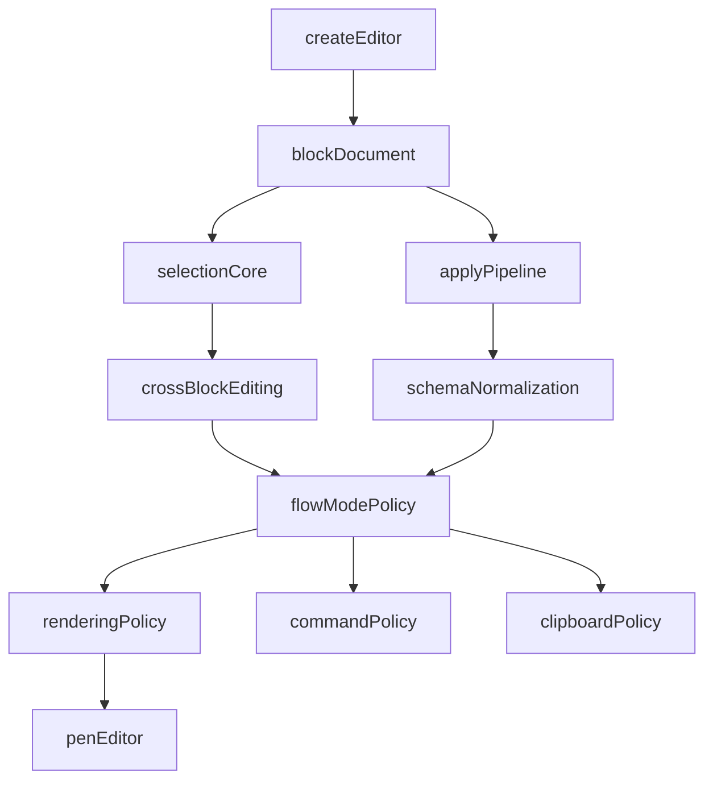

# Flow Mode RFC

## Status

Proposed.

## Summary

This RFC defines a simpler, Pen-native way to offer a basic rich-text editor experience without introducing a second authored document model.

The core decision is:

- Pen remains universally block-native
- simple rich text is implemented as a **flow document profile** of the existing block system
- continuity is achieved through schema constraints, rendering policy, selection behavior, command behavior, and reduced block chrome
- `DocumentSession`, `DocumentScope`, `editor.apply()`, and the existing block document structure remain foundational

This is the recommended architecture because it leans into Pen's strengths instead of forcing Pen to become a different kind of editor engine.

## Problem

Pen's current model is strong for structured block editing, but it can feel too block-shaped for users who want a simpler writing experience.

Today, a user who wants a basic rich-text editor gets:

- a block document model
- visible structural behavior
- interaction affordances optimized for general block editing
- cross-block editing that is improving, but not yet the default authoring feel

That creates friction for:

- prose writing
- lightweight documents
- classic rich-text editing expectations
- consumers who want a simpler editor profile without adopting a second architecture

## Core Product Thesis

Pen should **not** solve this by introducing a second authored root model.

Instead, Pen should:

- keep blocks universal
- define a constrained block profile for continuous writing
- make that profile feel like a basic rich-text editor

This preserves:

- one storage model
- one operation model
- one selection model
- one renderer architecture
- one extension surface

while still delivering a meaningfully simpler editor experience.

## Goals

- Offer a simple rich-text editing experience on top of the current block system.
- Preserve the block document model as Pen's only authored document model.
- Make flow documents feel continuous and lightweight in UX.
- Reuse existing block-aware ops, selection, normalization, import/export, and extension infrastructure.
- Keep the architecture aligned with Pen's headless, extension-first, CRDT-first design.

## Non-Goals

- This RFC does not introduce a second root kind such as `RichTextRoot`.
- This RFC does not replace the block model with a tree-native rich-text core.
- This RFC does not attempt to mimic ProseMirror's internal architecture.
- This RFC does not require layout, database, or app-heavy documents to behave like flow documents.
- This RFC does not remove advanced block editing; it defines a simpler profile on top of it.

## Architectural Decision

### Keep One Authored Model

Pen keeps exactly one authored document model:

- ordered blocks
- block-scoped inline content
- specialized block types for tables, databases, apps, subdocuments, and other structural content

There is no second authored root model.

### Introduce `FlowDocumentProfile`

`flow` is a document profile on top of the block model.

It changes:

- what block types are available by default
- how block UI is rendered
- how selection behaves
- how commands behave
- how paste/import/export are tuned

It does **not** change:

- the underlying CRDT representation
- block addressing
- the apply pipeline
- the editor session model
- the fact that documents are still made of blocks

### Persisted Profile vs View Mode

This RFC distinguishes two concepts:

- `documentProfile`
- `editorViewMode`

#### `documentProfile`

`documentProfile` is persisted document metadata.

Recommended initial values:

- `"structured"`
- `"flow"`

`documentProfile` governs authoring semantics such as:

- allowed and default block types
- command behavior
- paste/import shaping
- tool and AI write policy
- selection fallback bias

If two editors open the same document, they must agree on the same `documentProfile`.

#### `editorViewMode`

`editorViewMode` is optional per-view presentation policy.

It may tune:

- visible chrome
- handle visibility
- toolbar composition
- spacing density

It must not silently change document semantics.

#### Rule

If a behavior changes what the document is allowed to become, it belongs to `documentProfile`, not `editorViewMode`.

## Design Principles

### 1. One Block Model Everywhere

Flow mode must not introduce a parallel document core.

Anything that works in flow mode should still map cleanly onto the existing block architecture.

### 2. Continuity Is A UX Policy, Not A Storage Model

The editor should feel continuous because:

- cross-block text selection is canonical
- movement across adjacent text blocks is smooth
- select-all is document-first
- deletion and replacement across adjacent text blocks are normal
- visual block chrome is reduced or hidden

Not because blocks disappear from the data model.

### 3. Constrain The Surface, Not The Engine

Flow mode should be implemented by constraining:

- schema
- commands
- rendering affordances
- menus and insertion surfaces

The engine should remain general.

### 3a. Enforce Constraints At The Mutation Boundary

UI-only constraints are insufficient in Pen because documents can be changed by:

- collaborators
- AI tools
- importers
- extensions
- direct `editor.apply()` calls

So flow constraints must be enforced through explicit boundaries:

- schema/profile presets
- command policy
- importer policy
- exporter policy where relevant
- document-ops and tool policy
- optional `onBeforeApply` guards for profile enforcement

Flow is not just a UI skin.

Exporter policy where relevant means preserving the actual document graph, not
reinterpreting export as another authoring gate. In other words:

- import, paste, menus, tools, and AI writes are authoring surfaces and should
  be profile-aware
- exporters are serialization surfaces and should generally preserve existing
  seeded or migrated content, even when those block types are not default flow
  insertion targets

### 4. Specialized Blocks Remain First-Class, But Optional

Flow mode should bias toward prose-oriented blocks, but Pen should not need to delete support for:

- code blocks
- images
- embeds
- tables
- subdocuments

Instead, those become optional or explicitly inserted features rather than the primary editing experience.

### 5. Cross-Block Editing Becomes The Main Authoring Feel

The work already happening in cross-block selection is not a workaround. It is the architectural foundation of flow mode.

## What Flow Mode Is

Flow mode is a block-native document profile optimized for continuous writing.

It should feel like:

- a simple writing editor
- a lighter Docs-style surface
- a continuous rich-text canvas

It should not feel like:

- a Notion page with all the block UI still visible
- a fake second editor built beside Pen's main engine

## What Changes In Flow Mode

## A. Schema Profile

Flow mode defaults should prioritize inline-richtext block types such as:

- paragraph
- heading
- bullet list item
- numbered list item
- check list item
- blockquote
- callout
- code block, if included, as a deliberate prose-adjacent block

Flow mode should either hide, defer, or make optional:

- layout containers
- databases
- large structural widgets
- heavy app surfaces

This is a profile decision, not a schema-engine rewrite.

### Enforcement Requirements

Flow profile rules must be enforceable outside the React layer.

At minimum:

- default schema presets should bias strongly toward prose-oriented blocks
- importers should prefer flow-friendly block output
- tools and extension transforms should know whether the target document profile is `flow`
- invalid or disallowed structural transforms should be prevented or downgraded predictably

## B. Rendering Policy

Flow mode should render the same blocks with a lighter presentation policy:

- hide or reduce drag handles
- minimize explicit block affordances
- reduce spacing and chrome that emphasizes block boundaries
- render adjacent text blocks as part of one continuous reading and editing flow

`Pen.Editor.Content` remains block-based. The change is in presentation and interaction policy.

## C. Selection Policy

Flow mode should make cross-block text selection the normal path, not an exceptional path.

That means:

- dragging across adjacent text blocks produces canonical `TextSelection`
- shift-click expands text selection across blocks naturally
- `selectAll()` should prefer whole-document text selection in flow mode
- block selection should be reserved for clearly structural cases

This builds directly on the cross-block selection architecture instead of replacing it.

## C1. Flow Capability Classes

Every block type should be classified for flow behavior.

Initial capability classes:

- `flow-inline`
- `flow-structural`
- `flow-delegated`
- `flow-disallowed`

### `flow-inline`

Blocks that participate as continuous prose surfaces.

Examples:

- paragraph
- heading
- bullet list item
- numbered list item
- check list item
- blockquote
- callout text content

### `flow-structural`

Blocks that remain visible in the document flow, but are not treated as editable prose from the surrounding continuous surface.

Examples:

- image
- divider
- embeds with no inline editing contract

### `flow-delegated`

Blocks that are part of the document, but use specialized editing semantics.

Examples:

- code block
- table
- future specialized editors
- subdocument block

### `flow-disallowed`

Blocks or features that the flow profile should not allow by default.

Examples:

- databases
- layout containers
- heavy app surfaces unless explicitly enabled

### Required Behavioral Matrix

The implementation must define behavior for each capability class across:

- drag selection
- shift-click selection
- Enter
- Backspace
- Arrow navigation
- select-all
- paste near block boundaries
- slash insertion
- fallback to block selection

## D. Command Policy

Flow mode should bias commands toward continuous writing:

- Enter should preserve writing flow
- Backspace should merge across adjacent text blocks naturally where valid
- Arrow navigation should feel continuous across adjacent text blocks
- block conversion should remain available, but not dominate the default experience
- slash menus should emphasize text-oriented transformations first

The underlying ops stay block-aware.

### Required Command Rules

Flow profile command policy must be deterministic across UI and non-UI entrypoints.

That means the same semantic decision should be respected by:

- keyboard handlers
- toolbar actions
- slash menu actions
- tool-server and AI operations where applicable

## E. Clipboard Policy

Flow mode copy, cut, and paste should prioritize prose continuity:

- copying adjacent text blocks should preserve natural document text order
- pasted prose should import into adjacent text blocks sensibly
- importing HTML and Markdown should prefer flow-friendly block shapes

Again, this is behavior on top of the block model, not a new storage model.

### Import and Tooling Rule

Importers and tooling must target the active `documentProfile`.

For a `flow` document, the default behavior should be:

- prefer prose-oriented block output
- avoid introducing disallowed structural blocks unless explicitly requested
- preserve readability and continuity over maximum structural fidelity

## F. Toolbar and Surface Policy

Flow mode should prioritize text formatting and writing controls over block structure controls.

Examples:

- marks and inline formatting first
- heading/list toggles prominent
- structural block insertion secondary
- database/layout/app insertion hidden or explicitly opt-in

## Relationship To Existing Specs

## A. `spec/v01.md`

This RFC preserves the thesis that Pen is fundamentally block-native.

What changes is the product framing:

- Pen can offer both a structured block editing experience and a simpler writing-first flow experience on the same engine

## B. `spec/cross-block-selection-rfc.md`

That RFC becomes a foundational implementation spec for flow mode.

Cross-block editing is no longer only a “make blocks feel less broken” initiative. It becomes a first-class way to make the block model feel continuous for writing.

## C. `spec/wave-05-react-rendering.md`

The rendering layer stays block-based.

What changes is:

- rendering policy
- interaction policy
- which affordances are visible in flow mode
- how aggressively the field editor expands across adjacent blocks

## D. `spec/wave-03-editor-core.md`

The core remains block-native.

The main required core improvement is not a second root model. It is stronger support for multi-block text semantics in selection, replacement, deletion, and export.

## Why This Is Better Than A Dual-Root Architecture

This avoids:

- a second authored document model
- root-kind metadata and validation complexity
- a split op system
- a split selection model
- a split renderer architecture
- deep CRDT representation divergence

It preserves:

- Pen's strengths
- extension compatibility
- block-level AI tooling
- structural document transformations
- existing schema and normalization investments

It also keeps the product honest: Pen remains Pen.

## Required Core Work

This RFC still requires meaningful implementation work.

### 1. Finish Canonical Multi-Block Text Semantics

Core must fully support:

- multi-block `TextSelection`
- `getSelectedText()` across block ranges
- `replaceSelection()` across block ranges
- `deleteSelection()` across block ranges

This is the most important headless change.

### 2. Refine Selection Fallback Policy

The editor must clearly define when interactions become:

- text selection
- block selection
- delegated structural selection

Flow mode should strongly prefer text selection for adjacent inline-richtext blocks.

### 3. Add Mode/Profile Configuration

Pen needs an explicit configuration layer that distinguishes:

- persisted `documentProfile`
- optional local `editorViewMode`

Recommended shape:

- `documentProfile: "structured" | "flow"`
- optional `editorViewMode` for presentation-only differences

This should be a document metadata distinction when it affects authoring semantics.

### 4. Add Flow-Aware Rendering Policy

The React layer needs a way to:

- suppress or reduce block chrome
- tune placeholder behavior
- tune click-to-activate behavior
- prefer continuous range surfaces

### 5. Add Flow-Aware Commands

Command routing must respect the editor profile.

The core block ops remain unchanged, but the decision logic above them changes.

### 6. Add Flow-Aware Tool and Extension Enforcement

Flow profile must be respected by non-UI writers as well.

That includes:

- `@pen/document-ops`
- importer pipelines
- AI transforms
- extension-authored mutations
- `onBeforeApply` guards where profile enforcement is required

## Non-Requirements

This RFC explicitly does **not** require:

- new CRDT root types
- `Y.XmlFragment`
- generalized logical positions beyond block-addressed points
- a second normalization engine
- a second renderer root
- a second document state model

Those are all signs that the architecture is drifting away from Pen's strengths.

## Proposed Architecture

## Acceptance Criteria

This RFC is successfully implemented when:

1. Pen can offer a simple writing-first editor without changing the document model.
2. The same document and block structure can be edited in either a structured or flow-oriented presentation.
3. Cross-block text selection and editing feel canonical for prose-oriented blocks.
4. Block chrome is substantially reduced in flow mode.
5. Existing block-native features remain compatible with the same engine.
6. Pen does not need a second authored root architecture to deliver the experience.
7. Flow authoring rules are enforced consistently across UI, importers, tools, and AI writes.

## Final Recommendation

The optimal architecture is:

- one block-native authored model
- one apply pipeline
- one selection model
- one renderer architecture
- one extension ecosystem
- multiple editing profiles

Flow mode should be treated as a **first-class product profile of Pen's existing block system**, not as a second editor engine hidden inside the same repo.
