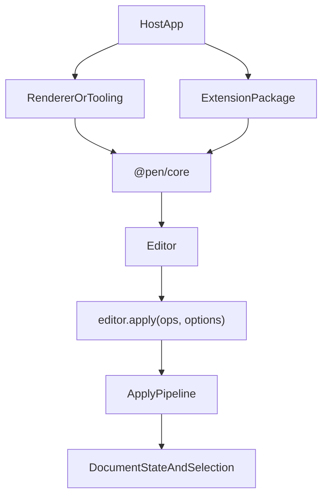

# @pen/core

## Purpose

`@pen/core` is the headless runtime authority for Pen. It owns editor creation, document state, selection, extension dispatch, normalization, decorations, and the canonical mutation path.

## Public Role

Every higher-level package depends on the contracts and runtime behavior established here. Renderer packages mount the editor, extension packages add behavior, and import/export packages prepare or consume document state, but `@pen/core` remains the place where document truth is created and mutated.

## Key Exports / Entrypoints

- Export map: `.`
- Runtime entrypoints such as `createEditor()`, `createHeadlessEditor()`, and `createDocumentSession()`
- Schema runtime exports such as `SchemaRegistryImpl`, `mergeSchemas`, and `SchemaEngineImpl`
- Read-model and editor helpers such as `DocumentStateImpl`, `SelectionManagerImpl`, `DocumentRangeImpl`, and `ExtensionManagerImpl`
- Decoration and inline-completion helpers such as `createDecorationSet()`, `mergeDecorationSets()`, `ensureInlineCompletionController()`, and `getInlineCompletionController()`
- Import and profile-policy helpers such as `blocksToOps()`, `normalizePendingBlocksForImport()`, `filterOpsForDocumentProfile()`, and related policy-reporting APIs
- Workspace scripts: `build`, `clean`, `test`, `typecheck`

## Dependencies And Boundaries

- Runtime dependencies: `@pen/content-ops`, `@pen/crdt-yjs`, `@pen/delta-stream`, `@pen/document-ops`, `@pen/markdown-serialization`, `@pen/schema-default`, `@pen/shortcuts`, `@pen/types`, `@pen/undo`
- Peer dependencies: No peer dependencies declared.
- Boundary: `@pen/core` is the runtime center of gravity for Pen and should remain headless.

## Runtime Model

The core runtime sits between package contracts and the packages that bind or extend the editor:

Important rules:

- `DocumentOp[]` is the mutation currency.
- Durable document writes go through `editor.apply(...)`.
- Structured operation origins can carry `groupId`, `requestId`, `actorId`, and `source` metadata so hosts can attribute and group mutations without inventing a parallel apply path.
- Default feature composition should flow through presets or explicit extensions; legacy `createEditor({ without })` remains deprecated compatibility rather than the preferred way to remove default features.
- Extensions can prepare work, observe editor events, and register slots, but they do not bypass the core mutation boundary.
- Renderer packages read `DocumentState`, `BlockHandle`, selection, and decorations from the editor; they do not become alternate document authorities.

## Headless Workflows

`createHeadlessEditor()` is the preferred factory for server-side or workflow-only editor use. It keeps Pen headless and applies the same document pipeline to existing CRDT documents without mounting a renderer. Hosts should use it for AI workers, export workers, migrations, and contract tests that need editor semantics without UI behavior.

Headless editors default to the core apply pipeline only. Hosts can opt into default extensions explicitly when a non-rendered workflow needs undo, shortcuts, or delta stream behavior.

## Integration Notes

- Path in workspace: `packages/core`
- Spec path mirrors workspace path: `packages/core.md`
- Typical adoption starts with `createEditor()` plus `@pen/schema-default` and `@pen/preset-default`
- Use `createEditor({ preset: defaultPreset(...) })` or explicit `extensions` for feature composition instead of the deprecated `without` option.
- Server/workflow adoption starts with `createHeadlessEditor()` plus a wrapped CRDT document.
- Schema composition happens here through the registry/merge APIs, not in renderer packages
- Serialization packages and tool packages should treat the editor as the authority boundary, even when they export convenience helpers

## Current Maturity / Intended Usage

Workspace package at version `0.0.0`; intended usage is current-state but still evolving. In practice, this is still the package that defines the architecture for the rest of the repo, so churn here has repo-wide impact.

## Non-goals

- Do not make `@pen/core` renderer-specific.
- Do not turn it into an application shell, transport layer, or auth surface.
- Do not let convenience helpers replace the editor as the source of mutation truth.
