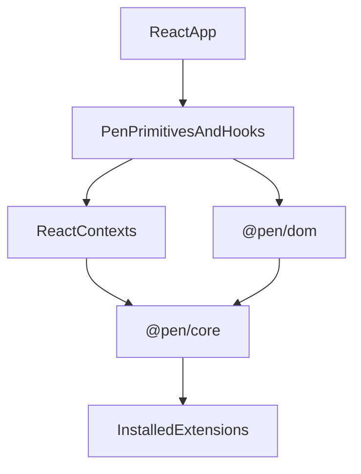

# @pen/react

## Purpose

`@pen/react` is the primary documented renderer surface for Pen. It binds the headless runtime to React components, hooks, contexts, and higher-level primitives for editor composition.

## Public Role

This package is where most adopters start when embedding Pen in a React application. It provides both a high-level convenience entrypoint and a lower-level compound-component surface, while keeping runtime authority in `@pen/core` and editing engine behavior in `@pen/dom`.

## Key Exports / Entrypoints

- Export map: `.`, `./ai`, `./ai-suggestions`, `./history`, `./multiplayer`, `./search`
- Convenience editor entrypoint: `PenEditor`
- Compound namespace: `Pen`
- Editor primitives such as `EditorRoot`, `EditorContent`, `EditorBlock`, `EditorCaretOverlay`, `CARET`, selection rects, and field-editor wrappers
- Toolbar, slash-menu, selection-toolbar, search, AI, AI suggestions, history, and multiplayer primitives
- Hooks such as `useEditor`, `useSelection`, `useDecorations`, `useBlockList`, `useSearch`, `useAI`, and related state hooks
- Advanced contexts and renderer options for custom composition
- Workspace scripts: `build`, `clean`, `test`, `typecheck`

## Dependencies And Boundaries

- Runtime dependencies: `@pen/ai`, `@pen/ai-suggestions`, `@pen/core`, `@pen/dom`, `@pen/history`, `@pen/multiplayer`, `@pen/schema-default`, `@pen/search`, `@pen/shortcuts`, `@pen/types`
- Peer dependencies: `@pen/import-html`, `@pen/import-markdown`, `react`, `react-dom`
- Boundary: `@pen/react` binds the headless runtime to React without taking ownership of document truth.

## Runtime Model

React components and hooks sit above the editor and the shared DOM editing engine:

Important responsibilities:

- Mount editor roots and block rendering surfaces
- Subscribe React state to editor state through hooks and contexts
- Install the shared field-editor session, paste importer slots, and captured document-keyboard handlers for the active editor root
- Delegate shared DOM editing, selection transition, table-cell navigation, and shortcut routing behavior to `@pen/dom`
- Surface extension state through React-friendly primitives rather than reimplementing extension logic locally

## Integration Notes

- Path in workspace: `packages/rendering/react`
- Spec path mirrors workspace path: `packages/rendering/react.md`
- `PenEditor` is the simplest integration path for most apps
- The `Pen` namespace exists for lower-level composition when hosts need toolbar, slash-menu, AI, search, or multiplayer surfaces
- Optional subpath entrypoints let hosts import AI, AI suggestions, history, multiplayer, and search surfaces without pulling from the root barrel directly.
- `Pen.Editor.CaretOverlay` renders an optional local caret for collapsed active text selections, exposes `CARET` variants, and hides the native caret while the overlay is visible.
- Optional importer peer dependencies stay peer-level because not every React integration needs HTML or Markdown paste/import support

## Current Maturity / Intended Usage

Workspace package at version `0.0.0`; intended usage is current-state but still evolving. This is still the main renderer the repo documents and validates most thoroughly.

## Non-goals

- Do not push core runtime, transport, or auth concerns into the React layer.
- Do not let React component state become a second document authority.
- Do not reimplement shared document keyboard, selection transition, table-cell, or DOM editing behavior locally just because React is the primary renderer.
