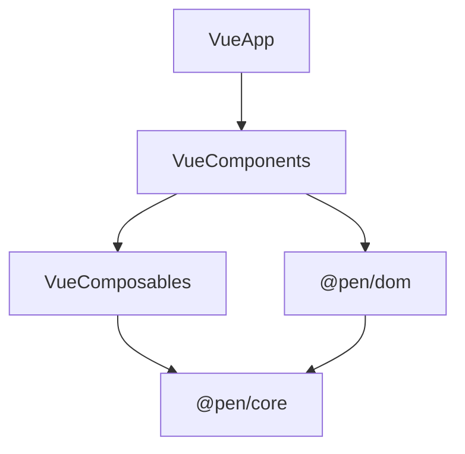

# @pen/vue

## Purpose

`@pen/vue` provides Vue rendering primitives for Pen. It is the shipped proof that Pen's editor lifecycle, field-editor integration, selection model, and renderer overrides work outside React.

## Public Role

This package gives Vue applications a lean but real renderer surface: core editor components, composables for editor-derived state, shared DOM field-editor integration, and a simple plugin for global component registration. Its strategic role is broader than its API size, because it validates the cross-framework architecture.

## Key Exports / Entrypoints

- Export map: `.`, `./plugin`
- Root exports such as `PenEditor`, `PenContent`, `PenBlock`, `PenInlineContent`, `PenFieldEditor`, and `PenEditorProps`
- Composables such as `useEditor`, `useSelection`, `useBlockList`, and `useDecorations`
- Plugin export: `PenVuePlugin`
- Public renderer and paste-importer types such as `RendererOverrides` and `PasteImporters`
- Workspace scripts: `build`, `clean`, `test`, `typecheck`

## Dependencies And Boundaries

- Runtime dependencies: `@pen/core`, `@pen/dom`, `@pen/types`
- Peer dependencies: `vue`
- Boundary: `@pen/vue` depends on `@pen/dom` and `@pen/core` and should stay lean.

## Runtime Model

The Vue renderer follows the same architectural split as React, but with a deliberately smaller public surface:

Important responsibilities:

- Mount the editor and shared field-editor engine in a Vue host
- Expose key editor-derived state through composables instead of duplicating state inside components
- Register the shared field-editor slots, paste importer/assets slots, focused/read-only/empty root attributes, and captured document-keyboard handling from `@pen/dom`
- Support renderer overrides so host apps can customize block rendering without forking the runtime
- Validate that keyboard routing, Escape selection transitions, select-all behavior, clipboard, and table-editing behavior stay portable across frameworks

## Integration Notes

- Path in workspace: `packages/rendering/vue`
- Spec path mirrors workspace path: `packages/rendering/vue.md`
- `PenEditor` is the main integration entrypoint; it renders default `PenContent` when no default slot is provided, and `PenVuePlugin` is optional convenience for global registration
- The package intentionally exposes fewer primitives than `@pen/react`; that is a design choice, not necessarily a gap
- Use this package when a Vue host needs Pen without rebuilding the editing engine

## Current Maturity / Intended Usage

Workspace package at version `0.0.0`; intended usage is current-state but still evolving. The package is intentionally lean, but it is now important enough that regressions here should be treated as architectural regressions, not just renderer-specific bugs.

## Non-goals

- Do not force full React surface parity before the shared cross-framework boundaries are stable.
- Do not move shared editing behavior from `@pen/dom` into Vue-only code.
- Do not let Vue component-local state become the authority for selection, decorations, or document mutations.
