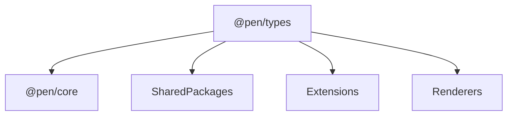

# @pen/types

## Purpose

`@pen/types` provides the shared contracts and lightweight runtime helpers for Pen. It defines editor, schema, extension, decoration, selection, tooling, history, undo, AI, and multiplayer interfaces, plus shared slot keys and low-level helper utilities that other packages rely on.

## Public Role

This is the contract package for the monorepo. It is the place where packages agree on shared shapes, lifecycle hooks, slot names, and protocol-level helpers without importing heavier runtime packages like `@pen/core` or any renderer.

## Key Exports / Entrypoints

- Export map: `.`
- Root export of package-wide contracts via `./types/index`
- Lightweight runtime helpers such as `defineBlock()`, `defineExtension()`, `prop()`, `resolveSchema()`, `generateId()`, and database/block-capability helpers
- Shared slot keys such as `FIELD_EDITOR_SLOT_KEY`, `SEARCH_CONTROLLER_SLOT`, `MULTIPLAYER_CONTROLLER_SLOT`, `HISTORY_CONTROLLER_SLOT`, and AI/undo-related slots
- Operation origin contracts such as `OpOriginType`, `StructuredOpOrigin`, `MutationGroupMetadata`, and helpers for resolving origin/group metadata
- Shared AI operation contracts such as selection targets, scoped-range targets, requested-operation provenance, and low-level range helpers
- Workspace scripts: `build`, `clean`, `test`, `typecheck`

## Dependencies And Boundaries

- Runtime dependencies: No runtime workspace dependencies declared.
- Peer dependencies: No peer dependencies declared.
- Boundary: `@pen/types` should stay lightweight and avoid owning editor state, schema normalization, or renderer behavior.

## Runtime Model

`@pen/types` is not a runtime authority package. It is the contract layer that the rest of the monorepo composes around:

Important rules:

- Slot keys and interfaces defined here are cross-package contracts and should remain stable unless a real architectural change requires otherwise.
- Lightweight helpers are acceptable when they support contract authoring or schema declarations, but heavier behavior belongs elsewhere.
- Other packages should depend on this package to agree on shapes, not to inherit hidden runtime behavior.
- Structured mutation metadata belongs here because `@pen/core`, undo/history packages, AI extensions, and host workflows all need to agree on attribution and grouping semantics.
- If multiple packages need to agree on AI mutation target semantics, that target contract belongs here rather than being duplicated in package-local types.

## Structured Mutation Origins

`OpOrigin` accepts both legacy string origins and structured origins. Structured origins allow a host or extension to attach:

- `type`: the stable origin type, such as `user`, `ai`, or a host-defined string.
- `groupId`: a logical mutation group shared across one or more `editor.apply(...)` calls.
- `requestId`, `actorId`, and `source`: optional attribution fields for workflow and diagnostics.

`getOpOriginType()`, `getApplyOptionsGroupId()`, and `createMutationGroupMetadata()` keep this behavior consistent across runtime packages. Hosts should use structured origins for AI/workflow changes instead of encoding request metadata in ad hoc strings.

## Shared AI Target Contract

`@pen/types` is the canonical home for shared AI operation target shapes.

- `ModelOperationSelectionTarget` represents an explicit live selection with `anchor`, `focus`, `blockId`, and `sourceText`.
- `ModelOperationScopedRangeTarget` represents a selection-like synthetic scope such as `block`, `paragraph`, `heading`, or `document`.
- `ModelOperationScopedRangeTarget` must carry explicit `blockIds` and `contentFormat` because runtime behavior depends on those fields for streaming previews, text rendering, and final apply.
- Shared helpers such as `isScopedSelectionTarget()`, `resolveSelectionTargetBlockIds()`, `renderSelectionTargetText()`, and `renderSelectionTargetBlockText()` belong here so client, server, and extension layers all interpret the same target the same way.
- Packages may add package-local planning metadata around these targets, but they should not redefine the target semantics themselves.

## Integration Notes

- Path in workspace: `packages/types`
- Spec path mirrors workspace path: `packages/types.md`
- Reach for this package when defining extension interfaces, tool contracts, slots, editor-facing types, or lightweight schema helpers
- `defineExtension()` and the slot constants are especially important because they coordinate extension lifecycle and cross-package discovery
- Keep additions here broadly reusable; if something only matters once runtime state exists, it probably belongs in another package
- When AI, playground, and transport layers need to share mutation target behavior, prefer adding the shared shape and helper here once instead of letting each layer infer it differently

## Current Maturity / Intended Usage

Workspace package at version `0.0.0`; intended usage is current-state but still evolving. In practice it is one of the most sensitive packages in the repo because seemingly small contract changes can cascade through most of the workspace.

## Non-goals

- Do not move editor state, schema normalization, or framework behavior into `@pen/types`.
- Do not hide meaningful runtime logic behind what should remain a contract package.
- Do not let convenience exports turn this package into a dumping ground for unrelated helpers.
- Do not allow multiple competing definitions of the same protocol-level target contract across packages.
